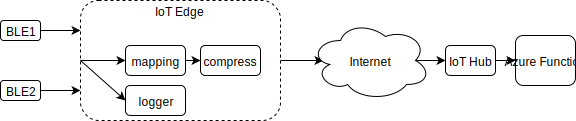

# IoT PoC

## Description

This demonstrates a proof-of-concept of using two different Bluetooth Low Energy simulated devices to aggregate sensor data in an IoT Edge, compress the data, forward it to IoT Hub and then handle the data using an Azure Function App.

## Architecture



## Deployment

The ARM template for the deployment is located within the assets directory. 

### IoT Hub

1. Once the IoT hub is created, go into the `Device Explorer` blade and add the devices you would like to simulate with generated keys.
2. Once you're done adding all the devices you want, you will need to add them to the `gateway_config.json` file in the iot-edge directory.

### Function App Setup

1. When creating the Function App, the template for EventHubTrigger should be used.
2. Use the IoT Hub name as the Event Hub name and click new on the right of Event Hub connection to select your IoT Hub.
3. Once created, add the code from the function-app directory.
4. Need to run `npm init` and `npm install` in project Kudu console to install any dependencies.

## Iot Edge Usage

### Install
```bash
$ npm install -g azure-iot-gateway
$ npm install
```

### Run
```bash
$ npm start
```